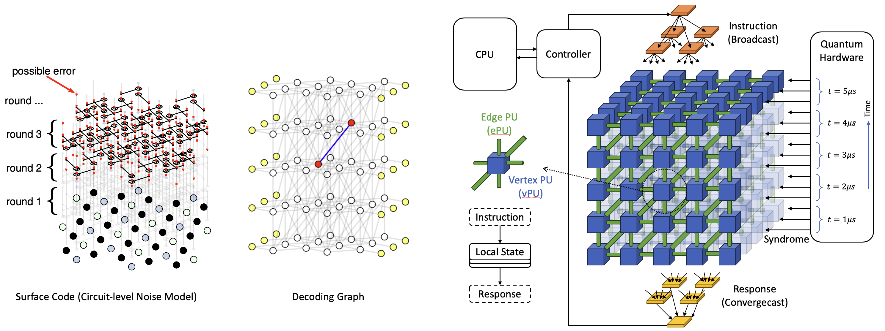
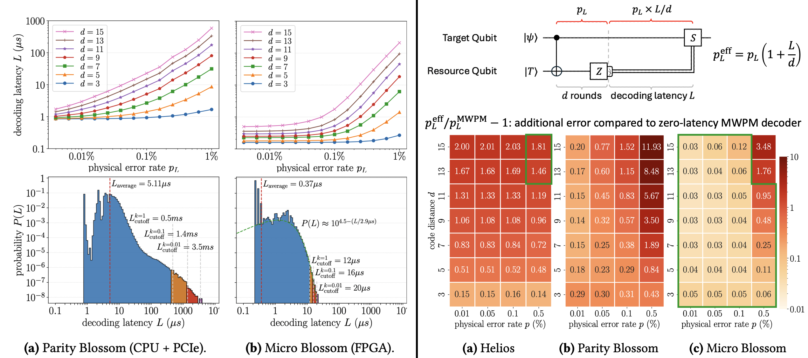

# Micro Blossom

A highly configurable hardware-accelerated Minimum-Weight Perfect Matching (MWPM) decoder for Quantum Error Correction (QEC).

Paper coming soon!!! Stay tuned!!!

Micro Blossom is a heterogenous architecture that solves **exact** MWPM decoding problem in sub-microsecond latency by
taking advantage of vertex and edge-level fine-grained hardware acceleration.
At the heart of Micro Blossom is an algorithm (equivalent to the original blossom algorithm) specifically optimized for resource-efficient RTL (register transfer level) implementation, with compact combinational logic and pipeline design.
Given arbitrary decoding graph, Micro Blossom automatically generates a hardware implementation (either Verilog or VHDL depending on your needs).
The architecture of Micro Blossom is shown below:



## Benchmark Highlights

**Correctness**: Like Fusion Blossom, we have not only mathematically proven the correctness, but also done massive correctness tests in cycle-accurate Verilog simulators under various conditions.

**14x latency reduction**: On a surface code of code distance $d=9$ and physical error rate of $p=0.001$ circuit-level noise model, we reduce the average
latency from $5.1 \mu s$ using Parity Blossom on CPU (Apple M1 Max) to $367 ns$ using Micro Blossom on FPGA (VMK180), a 14x reduction in **latency**.
Although [Sparse Blossom (PyMatching V2)](https://github.com/oscarhiggott/PyMatching) is generally faster than Parity Blossom, it still incurs $3.2 \mu s$ latency considering the $2.4 \mu s$ average CPU runtime (even with batch mode) and at least $0.8 \mu s$ CPU-hardware communication latency (PCIe round-trip-time) when using powerful CPUs (would be even higher when using Apple chips with thunderbolt). In practice, the CPU-hardware communication will incur even higher latency due to at least two transactions of CPU read (syndrome) and CPU write (correction).

**Better effective error rate** than both Helios (hardware UF decoder, which runs faster but loses accuracy) and Parity Blossom (running on M1 Max) on various code distances $d$ and physical error rates $p$. It is only at very large code distances ($d \ge 13$) and physical error rate ($p \ge 0.005$) when Helios starts to outperform Micro Blossom. The higher complexity at high $d$ and $p$ is inherent to the optimality of blossom algorithm though. As a side note, when trading accuracy for decoding speed, one could modify the software to seamless tune between UF and MWPM (see the [`max_tree_size` feature](https://github.com/yuewuo/fusion-blossom/issues/31) in the Fusion Blossom library) because [UF and MWPM decoders share the same mathematical foundation](https://arxiv.org/abs/2211.03288).

**Better worst-case time complexity and thus smaller tail in latency distribution**: We observe an exponential tail of the latency distribution for Micro Blossom. The software implementation has similar behavior but it has a much longer tail in the distribution. Micro Blossom has a better latency distribution for two reasons. First, Micro Blossom has a better worst-case time complexity of $O(|V|^3)$ than Sparse Blossom's $O(|V|^4)$. (We also propose a design that further reduces latency to $O(|V|^2 \log |V|)$ when using more complicated/costly, but still viable, software and hardware designs.) Second, the memory footprint of Micro Blossom is much smaller than both Sparse Blossom and Parity Blossom due to the fact that the decoding graph is not stored in the CPU at all. The CPU only has an active memory region that scales with $O(p^2 |V|)$ (Yes!!! not $O(p|V|)$ which is the average number of defect vertices, but rather $O(p^2 |V|)$ because most of the defects are not even reported to the CPU and solely handled by the accelerator).

Note that an improvement of latency is generally harder than improvement of throughput, because the latter can be achieved by
increasing the number of cores using coarse-grained parallelism (see our [Fusion Blossom paper](https://arxiv.org/abs/2305.08307)) but latency is bounded by how much the algorithm is sequential at its core. Given the complexity and sequential nature of the blossom
algorithm, it was even believed in the community that hardware acceleration of exact MWPM decoding is impractical. Yet we re-design the algorithm
to exploit the finest parallelism possible (vertex and edge parallelism), and achieves a significant reduction in latency.
Note that this doesn't mean we are sacrificing the decoding throughput: in fact, thanks to the pipeline design, the hardware accelerator
has a large decoding throughput capability that supports real-time decoding of at most 110 logical qubits ($d=9, p=0.001$) while achieving the throughput requirement of 1 million measurement
rounds per second.
While Micro Blossom does use more resources (152k LUT, 4-bit weighted circuit-level noise) than [Helios](https://github.com/NamiLiy/Helios_scalable_QEC) (94k LUT, unweighted circuit-level noise),
the resource usage per logical qubit is 1.4k LUT, lower than the 2.1k LUT per logical qubit for Helios.
This is due to the more efficient CPU-hardware collaboration of Micro Blossom where the hardware focuses on massive yet simple parallel computation while the
CPU focuses on complicated yet rare computation.



For people with concern about why we evaluate the average latency rather than worst-case latency: we believe only average case matters for several reasons below. Note that when we evaluate the decoding latency distribution, we do accumulate 1000 logical errors (2.5e8 samples in total) to make sure we capture the latencies with probability at or even below the logical error rate $p_L$. This doesn't change the average latency value by much though. For all other cases that only require average latency value, we just run 1e5 samples.

- Adding "idle QEC cycle" support at the lowest control layer is not hard, and is favorable for various reasons beyond QEC decoding: for example, some logical feedforward branches may have longer execution path and we should just let other idle logical qubits run their idle QEC cycles while waiting for a longer branch to run.
- Mathematically, only average case matters. The ultimate goal is that the overall logical error rate of a quantum circuit (including the added idle time due to decoding latency and feedforward) is low. Let's calculate the overall logical error rate including the latency-induced idle errors: Suppose the latency distribution is $P(L)$, then $\int_0^\infty P(L) dL = 1$ and $\int_0^\infty P(L) L dL = \bar{L}$ (aka average latency). Let's calculate the overall logical error rate. $p_L = \int_0^\infty P(L) p_{L0} (1 + L/d) dL = p_{L0} (1 + \bar{L}/d)$. This argument can be extended to more complicated circuits as well, but the idea is pretty intuitive: logical error rate is a also a statistical value that is linearly related to the latency.
- It is difficult to scale up QEC decoding to distributed systems while meeting hard deadline requirements, even though there are existing decoders that achieve hard realtime for a simple memory experiments at a very low physical error rate and code distance. We believe that in the long run when scaling up, all QEC decoding system will face the problem of not being able to achieve hard $1 \mu s$ deadline, but it doesn't matter that much according to the two points above.

## Project Structure

- src: source code
  - fpga: the FPGA source code, including generator scripts
    - microblossom: Scala code for MicroBlossom module using SpinalHDL library
    - Xilinx: Xilinx project build scripts
  - cpu: the CPU source code
    - blossom: code for development and testing on a host machine
    - blossom-nostd: nostd code that is designed to run in embedded environment but can also run in OS
    - embedded: build binary for embedded system
- benchmark: evaluation results that can be reproduced using the scripts included (and VMK180 Xilinx evaluation board)
  - behavior: CPU simulation, with exactly the same RTL logic
  - hardware: evaluation on hardware
    - bram_speed: understand the CPU-FPGA communication cost under various clock frequencies
    - decoding_speed: evaluate the decoding latency under various conditions and its distribution on real VMK180 hardware
    - resource_estimate: post-implementation resource usage


## Usage

Micro Blossom consists of two parts: the CPU program in Rust and FPGA program in Scala.
The FPGA part has a CLI program that generates Verilog/VHDL files given a decoding graph input.
The decoding graph input is defined by a JSON format in `src/fpga/microblossom/utils/SingleGraph.scala`.
A few examples of how to generate and use this decoding graph is below

```sh
# 1. generate example graphs in ./resources/graphs/*.json
cd src/cpu/blossom
cargo run --release --bin generate_example_graphs
cd ..
# (if you want to use the visualization tool to see these graphs, check src/cpu/blossom/bin/generate_example_graphs.rs)

# 2. use one graph to generate a Verilog
# you need to install Java and sbt build tool first, check:
# https://spinalhdl.github.io/SpinalDoc-RTD/master/SpinalHDL/Getting%20Started/Install%20and%20setup.html
mkdir gen
sbt "runMain microblossom.MicroBlossomBusGenerator --graph ./resources/graphs/example_code_capacity_d3.json"
# (for a complete list of supported arguments, sbt "runMain microblossom.MicroBlossomBusGenerator --help"
# this command generates Verilog file at `./gen/MicroBlossomBus.v` with a default AXI4 interface.
```

The generated Verilog can be used either in simulation (see test cases in `src/cpu/blossom/src/dual_module_axi4.rs` and `benchmark/behavior/tests/run.py`) or real hardware evaluation (see test cases in `benchmark/hardware/tests/run.py` which runs the same behavior tests but on real FPGA hardware).

The benchmark scripts automate this process of generating the graphs, Verilog and the Xilinx project.
For any question of how to use the project, please [email me](mailto:wuyue16pku@gmail.com).
