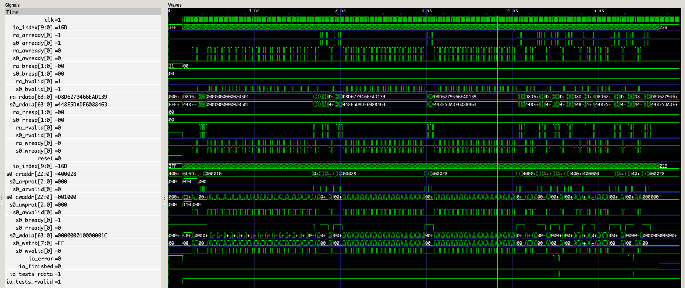

# Debugger

## ReplayAxiLite4

This will generate a single verilog file that can be used to debug the micro blossom module with axi4-lite interface.

To use this, first generate a debugger file

```sh
# in /src/cpu/blossom folder
EMBEDDED_BLOSSOM_MAIN=test_micro_blossom DUMP_DEBUGGER_FILES=1 cargo run --release --bin embedded_simulator -- ../../../resources/graphs/example_code_capacity_d3.json
```

This will generate a debugger file at `./simWorkspace/MicroBlossomHost/test_micro_blossom/s0.debugger`, which records the signal at every clock cycle.
We will generate a test case which doesn't require the involvement of CPU, and just replay the recorded data and checks for the results.

```sh
# at / folder

# generate the verilog file
sbt "runMain microblossom.debugger.ReplayAxiLite4Generator ./simWorkspace/MicroBlossomHost/test_micro_blossom/s0.debugger --graph ./resources/graphs/example_code_capacity_d3.json"
# check generated verilog at ./gen/ReplayAxiLite4.v

# run the test case
sbt "runMain microblossom.debugger.ReplayAxiLite4Test ./simWorkspace/MicroBlossomHost/test_micro_blossom/s0.debugger --graph ./resources/graphs/example_code_capacity_d3.json"
```

#### Bug Fix 1 (2024.3.31)

`val supportAddDefectVertex = opt[Boolean](default = Some(true), descr = "support AddDefectVertex instruction")`

I forgot to default support this instruction, meaning the generated verilog is not the same as the simulated one.


Fixing this eliminates most of the inconsistencies, shown as the signal `io_tests_rdata`.



However, there are still some inconsistency left. I suppose this is also something related to the configuration
but I haven't found it now.

#### Bug Fix 2 (2024.3.31)

Another configuration bug... The Rust program doesn't support offloading, so it just remove the offloading completely using

```rust
// TODO: later on support offloading
micro_blossom.offloading.0.clear();
```

However, the generated hardware already supports offloading, and thus fails the `test_micro_blossom.rs` test case which
assumes no offloading exists.

Solution: offloading should be controlled by a flag in `DualConfig` and defaults to off.
This allows the graph json to stay as is while we can choose to use the offloading feature or not.
As an optimization feature (which also consume more hardware resources), turning it off is a good choice.
